# 2026 OOPL Final Report

## 組別資訊

組別：第61組 
組員：113590028 黃暉帆、113590001 楊竣升 
復刻遊戲：Fireboy & Watergirl In The Ice Temple（冰火姊弟 3 冰宮冒險）

## 專案簡介

### 遊戲簡介
《冰火姊弟》（或稱冰火人、Fireboy & Watergirl）是一系列經典的雙人協作冒險遊戲。玩家需同時操作火男孩（Fireboy）與冰女孩（Watergirl），利用兩人對應元素池（冰、火）的抗性，合作收集寶石並規避毒沼，共同解開機關順利到達出口。

關鍵要素： 
- 角色特性： 火娃不怕火但怕水，水娃不怕水但怕火，且兩人都不能觸碰毒沼。
- 遊戲目標： 合作操作、解開機關，收集相應顏色的寶石並抵達最終出口。 
- 操作方式： 為雙人合作闖關遊戲，一位玩家使用 WAD 鍵，另一位使用方向鍵。 
- 遊戲系列： 包括森林冒險、光明神殿、寒冰宮殿等不同主題的關卡。（我們製作的是第三版的冰宮）

總而言之是一款非常考驗雙人配合默契的益智遊戲。

參考影片： https://www.youtube.com/watch?v=4mnXDSAYWRY

### 組別分工
113590028 黃暉帆：
- 碰撞系統 Collision System 實作 (碰撞箱)
- 原版地圖轉換程式 (convert)
- Sprite Sheet 精靈圖素材圖片切割
- 外掛系統 develop mode（顯示碰撞箱、直接通關、無敵星星...）
- 遊戲地圖地形場景實作
- menu關卡選單實作
- 機關 UI 與動畫實作（按鈕、搖桿、平台、方塊、倒計時按鈕...）
- 藍、紅寶石與特殊寶石實作
- 開門動畫與UI、過關機制
- 遊戲邏輯實作（撿寶石、角色死亡動畫與重生機制）
- 遊戲視窗縮放功能
- 機關染色調色功能
  

113590001 楊竣升：
- 角色操作、動畫與摩擦碰撞
- 地圖場景實作（地圖素材切割、地圖資料讀取與顯示）
- 斜坡顯示與碰撞
- 水池動畫、碰撞與凍結融化機制
- 冰雪地形碰撞

## 遊戲介紹

### 遊戲規則

- **遊戲目的**
  - 利用機關、躲避陷阱危害，走到各自的終點。
  - 獲取所有寶石。
  - 任一角色死亡，視為關卡失敗，立即重置關卡。
- **操作按鍵**
  - 方向鍵（左右上）操作火娃水平移動與跳躍
  - 方向鍵（W,A,D）操作水娃水平移動與跳躍
- **地圖場景與物件**
  - **終點門**
   水娃與火娃各有一扇專屬的終點門。兩人都走到對應的門前方並站定，才能通關。
  - **寶石**
    - 分為藍紅兩色。通關過程中水娃與火娃只能蒐集與自身同色的寶石。
    - 未蒐集所有寶石不影響通關。
    - 備註：原作中在通關時會得到評級（由高到低分為綠、橙、紫三種評級），是否蒐集完所有寶石只會影響評級。因時間有限，本組未實作通關評級機制。
  - **元素池（陷阱）**
    - 水池：水娃可以正常通行；火娃接觸則死亡。
    - 岩漿：火娃可以正常通行；水娃接觸則死亡。
    - 毒沼：水娃與火娃接觸毒沼皆會死亡。
  - **機關**
    - **普通按鈕**
      - 可控制移動平台或閘門。
      - 按住時啟動，鬆開時解除啟動。
    - **搖桿**
      - 可控制移動平台或閘門。
      - 可左右推動並於啟動與非啟動之間轉換，朝左為啟動，朝右為非啟動。
    - **定時按鈕**
      - 可控制移動平台或閘門。
      - 按住時啟動，鬆開時開始倒計時，期間維持啟動，計時結束後解除啟動。
    - **白色按鈕**
      - 形狀與普通按鈕相同，為白色。
      - 可控制水元素池凍結或融化。按下時若目標元素池為水，將其凍結；反之（為冰時）則將其融化。 
      - 轉換結束後按下按鈕才會再次觸發凍結或融化效果。
      - 備註：原作的水池凍融機制本來是由光束（藍光束與紅光束）觸發，考量到時間有限與實作上過於複雜，故妥協更改為以按鈕觸發。
    - **移動平台與閘門**
      - 啟動時，沿固定路線移往特定位置；非啟動時，沿固定路線移回原位。
      - 分為水平與垂直，可承載角色移動或阻擋角色行進，視關卡設計而定。
    - **方形石塊**
      - 可推移的墊腳石。
  - **冰雪地形**
    - 角色在踩踏到積雪或冰面（凍結水池）時，移動速度和跳躍與爬坡能力會受到影響。
    - 水娃：無法跳躍，左右移動變得極為緩慢，仍可爬上斜坡。
    - 火娃：無法跳躍，左右移動稍微加速（打滑），無法正常爬上斜坡（快速滑落）。

### 遊戲畫面
|   階段   |                        遊戲畫面                        |
|:------:|:--------------------------------------------------:|
|  開始畫面  |    |
|  關卡選單  |  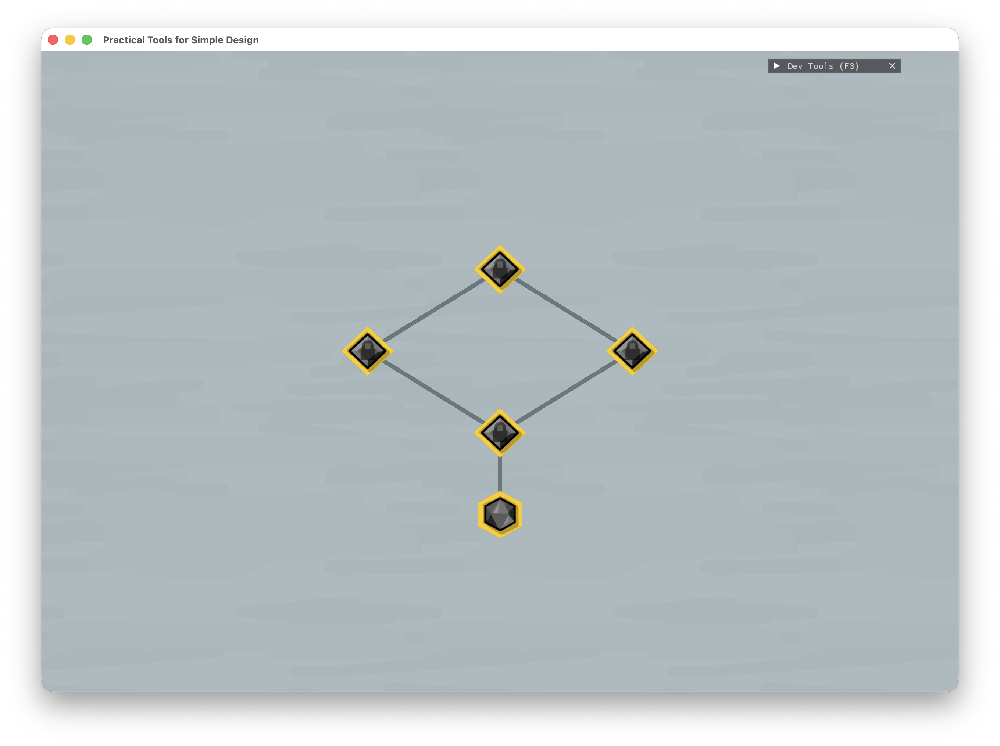  |
|  第一關  |  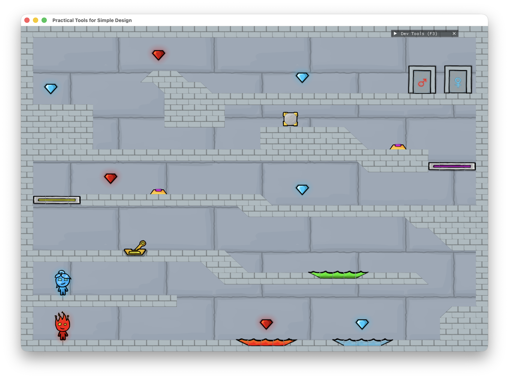  |
| 第二關  | 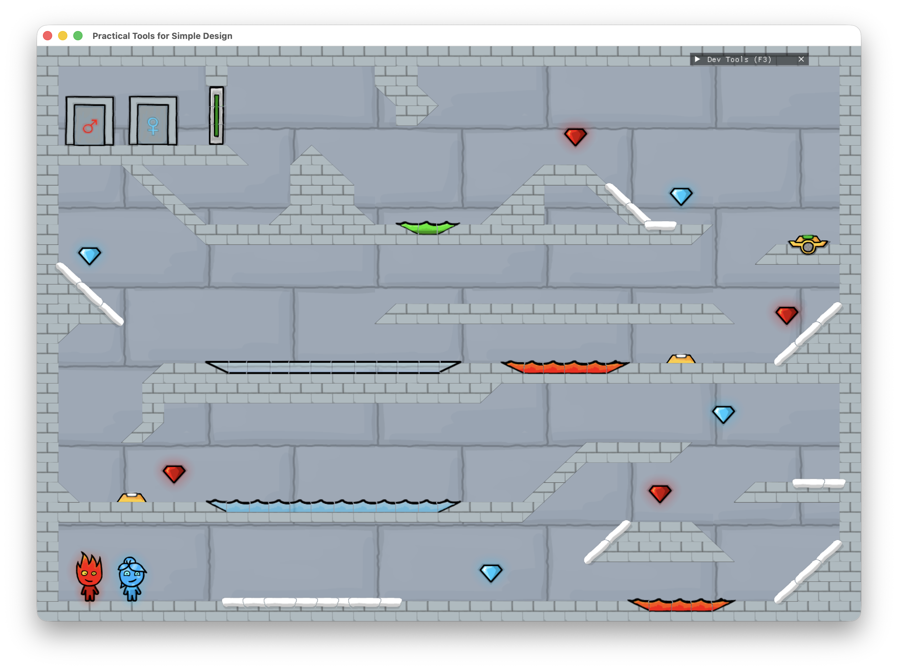  |
|  第三關  |  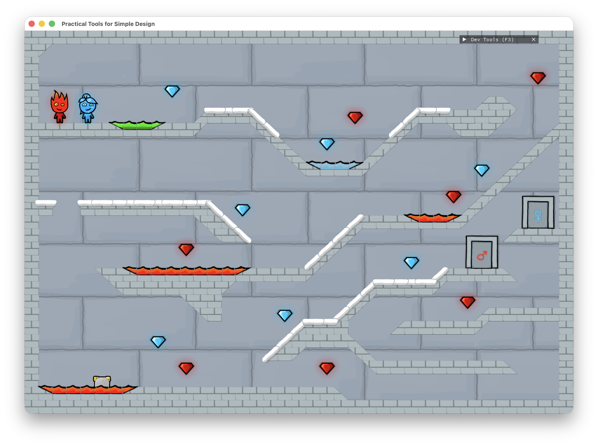  |
|  第四關  |  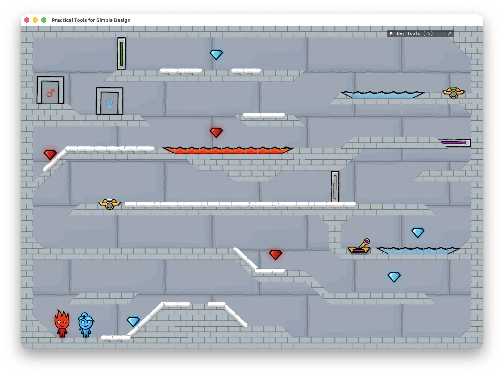  |
|  第五關  |  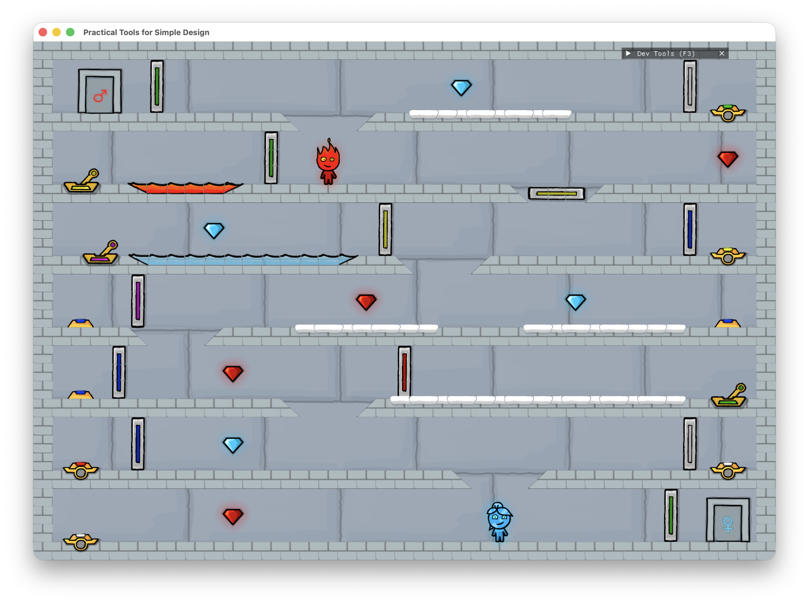  |
| 角色死亡 | 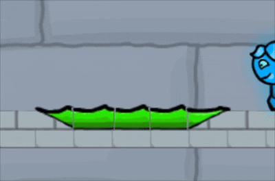 |
|  搖桿觸發  |  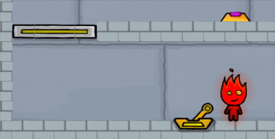  |
|  按鈕觸發  |  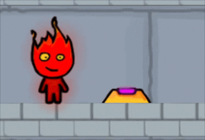  |
|  白色按鈕觸發  |  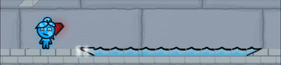  |
|  倒計時按鈕觸發   |  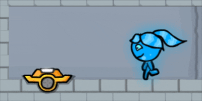   |
|  雪地效果   |  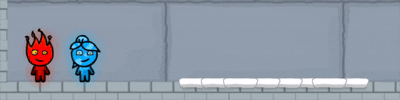   |
| 過關動畫 | 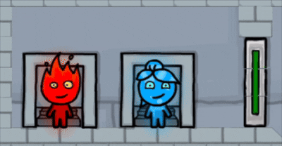 |
| 開發者外掛介面 | 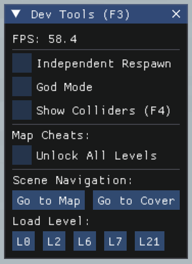 |
| 碰撞箱顯示 | 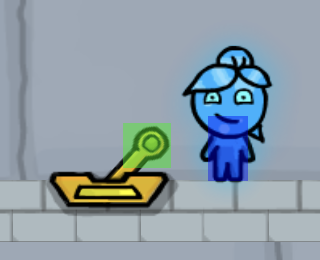 |
|  角色泡水顯示  |  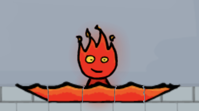  |

## 程式設計

### 程式架構

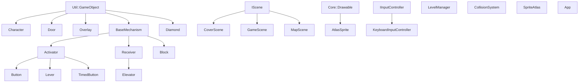

- `Util::GameObject` - PTSD 定義的遊戲物件
  - `Character` - 主角色（水娃與火娃）
  - `Door` - 終點門物件
  - `Overlay` - 場景覆蓋物（元素池）
  - `Diamond` - 寶石物件
  - `BaseMechanism` - 機關物件
    - `Block` - 方形石塊物件
    - `Activator` - 觸發器物件
      - `Button` - 按鈕物件
      - `Lever` - 搖桿物件
      - `TimedButton` - 計時按鈕物件
    - `Receiver` - 接收器物件
      - `Elevator` - 移動平台物件
- `IScene` - 場景（介面）
  - `CoverScene` - 開始畫面場景
  - `MapScene` - 關卡選單場景
  - `GameScene` - 關卡內部場景
- `Core::Drawable` - PTSD 定義的可繪製物件
  - `AtlasSprite` -
- `IInputController` -
  - `KeyboardInputController` -
- `LevelManager` - 關卡物件管理系統（資訊讀取與顯示）
- `CollisionSystem` - 碰撞系統
- `SpriteAtlas` -
- `App` - 主遊戲架構

### 程式技術

- **機關物件繼承鏈**
    - 在實作機關時，我們發現各個機關有很多重複的地方，所以我們拉出了`BaseMechanism`繼承`Game Object`。然後因為機關有分為兩類：觸發器`Activator`和接收器`Receiver`，我們將他們繼承`BaseMechanism`來實現物件的基本機制。然後在 `Activator` 和 `Receiver` 的子類別各自放該功能的機關Object。
- **關卡地圖**
  - 在製作地圖時，因為考慮到需要批量產出地圖，所以我們有寫了一個`convert.py`的轉換程式，能夠將原版的地圖格式架構轉換成我們遊戲中的格式，幫助我們減少了很多需要自行製作還原地圖的時間。
- **關卡系統**
  - 讀取 JSON，新增或修改關卡時，不需要修改 C++ 程式碼。
- **Sprite Sheet 大圖切圖功能**
    - 在一開始搜集素材時，因為我們找到的素材都是使用`Sprite Sheet`（整張大圖有很多小圖素材，需要使用附檔的.json來切圖，這樣在讀檔時會比需要連續讀好幾十張圖的動畫還方便快速），但是我們有詢問過製作 PTSD 架構的學長有沒有支援 Sprite Sheet 的功能，不過很可惜沒有，所以我們自行撰寫實作了 Sprite Sheet 大圖切圖的邏輯並應用在我們的專案中。
    - 減少大量單張圖片載入，也方便管理動畫素材。
- **介面使用**
    - `IScene`：將各個場景都會用到的基礎部分寫在`IScene`讓其他的Scene當作介面引入。實作了像是場景的初始化、更新、以及畫上DevMenu(開發者外掛)的純虛擬函式。
    - `IInputController`：將按鍵輸入的控制獨立拉出成介面，設定左右方向以及是否跳起的純虛擬函式，之後再做擴充時，像是如果要換成使用遊戲搖桿來玩，擴充就更方便。
- **Mediator 機關觸發系統**
  - 我們的專案中時做了TriggerMediator作為`Activator`和`Receiver`的溝通中間人，讓按鈕、搖桿、計時按鈕不需要直接持有平台物件。
  - 透過 group_id 把觸發器與接收器連接起來，降低機關之間的耦合度。
- **開發者工具 / Debug Mode**
  - 我們製作了開發者工具的模式，幫助我們在debug程式碼時能夠更有效的測試發現問題點，我們實作了下面幾樣實用的開發者工具。
    - 顯示碰撞箱。
    - 無敵模式。
    - 直接通關。
- **定義列舉型別 (enum)**
  - 元素`Element`：定義元素（如 Water, Fire 等），統一不同類別（如 Character, Overlay, Diamond, Door 等）的相同屬性標籤，有效將物件間的互動邏輯解耦。進行碰撞或觸發判定時，只需比對 `Element` 即可決定相容性或危害判定，無須為每種物件組合寫死判斷式。
  - 踩踏狀態`GroundState`：表示角色當前的腳底物理狀態（如 Air, Ground, Ice 等），主要用於碰撞偵測以及動態調整角色的摩擦力與速限。
  - 地形`TerrainType`（In `LevelDefinition.hpp`）：關卡地磚類型（如 Block, SlopeBL, SnowBlock 等），表示關卡內部地形，具備相應 int 值，利於從 Json 讀取整數陣列後直接轉型，同時也用於碰撞判別。
- **斜坡與淺坑的進階碰撞**
  - 突破傳統 2D 平台遊戲僅能處理正方形邊界的限制，在`CollisionSystem.cpp`中實作遊戲體驗性更佳的地形適應系統：
    - 透過`IsSlope()`與`CalculateSlopeSurfaceY()`判斷斜坡並計算斜坡表面高度，使角色能貼齊斜坡滑順移動。
    - `IsSolidWall()`實作上下半身分離探測邏輯，針對角色上下半身的碰撞偵測點採取不同界線與寬容機制，達成更平滑而不卡牆的滑順體驗。
    - 針對元素池地形（如 Water, Fire 等），在判斷碰撞時將邏輯轉為淺坑地形，讓元素池的兩側淺坡可被`IsSlope()`偵測，使角色可以在視覺與物理表現上更自然地「涉水」。
- **動態速度計算**
  - 擬真加減速系統：捨棄呆板的常數位移，在角色移動時以自身加速度起步、以摩擦力自然止步，實踐更貼近真實的物理操作，同時還原角色在冰面或積雪上特有的慣性打滑效果。
  - 動態速限：依據所在環境（一般地面、雪地、空中）即時切換最高速限。平時壓低速限維持合理速度精準操控，起跳瞬間則拉高速限以賦予跳遠衝勁；同時更真實地還原角色在雪地行動時的物理操作差異。

### 使用到 AI/AI Agent 的部分
- Google Gemini
  - 程式實作建議與討論
  - 協助除錯
- Codex
    - 程式實作建議與討論
    - 協助除錯

## 結語

### 問題與解決方法

- **地圖讀取與轉換**
  - 我們最初在實作讀取關卡的 Json 檔的部分時，是直接讀到數字陣列後把每格對應的地形圖片顯示出來，但這樣在判斷碰撞時可讀性很差，而且不好對特定物件實作動畫（像元素池會有流動的視覺效果）。所以我們只好大改原有的程式邏輯，先定義好 enum `TerrainType`並為每個地形賦予相應的 int 型別，在`LevelLoader.cpp`把讀到的陣列直接用`static_cast<TerrainType>`轉型後存入關卡的地形陣列`level.terrainLayer`，在後續判斷碰撞時輕鬆很多；同時若地形剛好為元素池， 會額外在`level.overlayLayer`陣列存入元素池的位置、元素與寬度等資訊，以便在`GameScene.cpp`創建動態元素池物件。
- **地磚素材裁切**
  - 一開始要顯示基本地磚（`Resources/reference/fireboy_and_watergirl_3/atlasses/GroundAssets.png`內的圖像）時，我們發現原版似乎是直接框出一個不規則的大多邊形作為地圖顯示與碰撞的框架，然後只用一個大圖片連續拼接去填入那個框架就可以了。但我們使用的 PTSD 不確定有沒有辦法實現這個功能，就算有我們也不知道如何實作，我們當下手邊能用的就只有從`Sprite Sheet`切出小圖搭配`Tilemap`拼貼成地圖的功能。所以我們找到的辦法是，先自己用`Photopea`把地圖中會用到的各種形狀的方塊切好（切成地圖網格的最小單位）變成一張張獨立的小圖，然後用`Free Sprite Sheet Packer`把這些小圖包成一張大圖，才終於讓地磚們成功在地圖上顯示。
- **碰撞機制修正**
  - 碰撞系統`CollisionSystem.cpp`是整個專案實作下來最常冒出 BUG 的部分，尤其是斜坡與天花板的碰撞邏輯，總是在好不容易能順利執行時丟出意想不到的驚嚇。
  - 首先是天花板，我們某次測試發現角色在斜跳頂到天花板時會被卡到頓一下，然後就會跳不過本應跳過的元素池。經過檢查發現是水平碰撞與垂直碰撞無法同步而產生的問題：我們原本先判斷水平碰撞，在水平方向上碰到牆體會強制擋住角色並將其水平速度歸零；然後才判斷垂直碰撞，如果有碰到天花板就彈開。這樣的機制與順序安排會在角色斜跳要跳過陷阱卻頂到天花板時，因為先判斷水平碰撞，角色的頭頂會先在天花板裡水平移動撞到另一塊天花板，此時水平速度會被強制歸零， 再開始判斷有沒有頂到天花板。導致天花板還來不及把角色彈開，角色就已經在天花板間撞到頭，然後只能無助地落入陷阱。但如果改成先判斷垂直碰撞再判斷水平碰撞地順序，又會反過來，在貼著牆斜跳時被牆卡住跳不上去。所以經過反覆修改與詢問 AI，最後我們把頭部碰撞探測器分成兩個部分，垂直碰撞的感測位置仍在頭頂附近，但水平碰撞的感測位置被稍微下移到大概落在肩膀位置，這樣在斜跳時，頭頂的垂直碰撞感測器一定會在水平感測器之前先一步碰到天花板然後把角色彈開 ，水平感測器就因此不會被天花板干擾。
  - 再來是斜坡。斜坡是這個遊戲的角色在關卡地圖間穿梭時不可或缺的地形元素與特色，也是時常引發 BUG 的碰撞機制大亂源。首先我們為了讓角色在下坡時僅靠水平移動就能帶動垂直下滑，希望在下滑時腳底能緊貼斜坡表面而寫了一個吸附機制，讓角色不會因為水平移動太快而飛離斜坡。但這個吸附機制讓角色的頭在靠近相同高度的斜坡時會被吸附到貼齊地面，然後角色就因此陷入牆裡了。我們後來是讓斜坡對上下半身的碰撞點的邏輯分離，只在下半身接近時才啟動吸附效果，才解決了這個滑稽的問題（當時檢查水平和垂直碰撞檢查半天找不到問題，後來才發現是斜坡在搞鬼，已氣瘋）。另一個令我印象深刻的問題是，角色踩得上第一格的斜坡，但想爬上第二格卻卡住上不去。後來發現是水平位移先被計算，導致角色在斜坡邊緣想上坡時水平位移往旁邊碰到實心磚牆而被擋住。它要爬上去的下一格斜坡在斜上方的方向，僅靠簡單的水平與垂直碰撞會被斜坡下的實心磚牆絆住。所以我們為此額外設計了寬容機制，當下半身已經位於斜坡上且想要水平移動爬上下一格斜坡，就無條件開放角色在水平方向的位移，這才讓角色能順利爬上斜坡。
- **搖桿偵測機制**
  - 在實作搖桿機關時，我們遇到一個問題，就是搖桿的觸發機制採用的是當角色進入搖桿周圍的正方形的範圍就會觸發，但是這樣會導致角色只要進入這個範圍就算不用推動搖桿也會觸發，這不符合遊戲的體驗，所以我們修改了搖桿的碰撞機制，我們加上了實體碰撞箱的方式來模擬原版遊戲推動搖桿來觸發的動作。
  - 然而，在實作實體碰撞箱的過程，我們遇到了另一個問題，在測試時碰撞箱的位置與我們預期的位置不太一樣，導致角色在奇怪的地方觸發搖桿，然後被實體的碰撞箱卡住過不去，就像是憑空出現了空氣牆的感覺。經過多次的位置調整，仍然無法解決這個問題。最後我們實作了開發者外掛工具的將碰撞箱已實體可視化的方式顯示在地圖上，幫助我們偵錯以及解決定位的問題。最後終於把搖桿實體碰撞箱的問題修好，實現出現在流暢的搖桿觸發機制。
- **地圖格式轉換**
  - 在遊戲中，我們需要讀取地圖資訊並將其顯示在畫面上。然而，原版遊戲的地圖資訊是使用自訂的數字陣列格式儲存，這使得我們很難直接讀取和使用。
  - 首先，我們研究了原版遊戲的地圖資料結構，並編寫了一個convert 的 Python 程式來解析原始地圖檔案。這個工具能夠提取地圖的尺寸、圖塊類型（如地面、斜坡、障礙物等）以及機關位置等關鍵資訊，並將其轉換為 JSON 格式，使 C++ 程式能夠方便地讀取和處理。
  - 接著，我們在 C++ 程式中實作了 `LevelDefinition` 類別，負責解析 JSON 資料並初始化遊戲場景。這個類別包含了讀取地型數字陣列、創建地形物件、生成角色初始位置、放置機關以及物件位置等功能資訊。
  - 透過這個流程，我們成功將原版的地圖格式轉換為我們定義的 JSON 格式，不僅降低了自行手刻地圖的成本，也提高了程式的可維護性和擴展性。當我們需要修改地圖或新增關卡時，只需編輯 JSON 檔案即可，無需修改 C++ 程式碼。
  - 一開始在製作地圖時，我們使用的是字串陣列的方式來讀取顯示，後來參考原版遊戲使用的是數字陣列的方式加上物件資訊位置宣告的方式去實作的，所以我們將我們原本的字串陣列的方式優化改成使用二維數字陣列的方式去解析。在中間過渡期時，我們有使用到**多型**的概念來實作同時支援字串陣列與二維數字陣列的方式去讀取顯示。

### 自評

| 項次 | 項目                   | 完成 |
|------|------------------------|----|
| 1    | 這是範例 | V  |
| 2    | 完成專案權限改為 public | V  |
| 3    | 具有 debug mode 的功能  | V  |
| 4    | 解決專案上所有 Memory Leak 的問題  | V  |
| 5    | 報告中沒有任何錯字，以及沒有任何一項遺漏  | V  |
| 6    | 報告至少保持基本的美感，人類可讀  | V  |

### 心得

- **113590028 黃暉帆**
  - 在這學期製作「冰火人之冰宮冒險」這款遊戲的過程中，讓我理解到遊戲開發不僅僅是撰寫程式碼把遊戲功能製作出來而已，還要考慮開發過程的程式架構、使用者體驗、以及未來的可擴充性與可維護性。透過上學期在OOP課程上學到的知識，我們將其實作應用到我們的遊戲中，像是繼承鏈、介面、組合、純虛擬函式...等概念。透過程式架構的優化，能夠讓共同開發的團隊專案更清晰可讀、往後也更容易維護擴充。
  - 開發過程中我最印象深刻的是在設計遊戲機關時的規劃，我們使用到繼承鏈的概念，將基礎共有的機關邏輯與功能放在`BaseMechanism`，然後再分成觸發器`Activator` 和 接收器`Receiver`來繼承`BaseMechanism`，因為機關大致可以分為兩類，一類像是按鈕、搖桿等用來觸發的機關；另一類是像是平台等會因為觸發而有動作的機關。這樣的設計增加了程式碼的整潔度以及可讀性，之後要再增加機關時擴充性也更方便。
  - 這次的遊戲復刻製作是我第一次從零開始完整製作一款遊戲，實作過程中，雖然常常出現問題或是bug，但在解決問題與 debug 的過程中，讓我學習到很多，也讓我更理解如何讓程式架構符合物件導向的精神。每次看到遇到的困難能夠順利解決並跑出成果的時候，心裡真的非常有成就感！雖然過程中遇到不少困難以及 bug，但在團隊成員的討論以及與 AI 共同思考解決問題的過程中，我學到了很多遇到問題解決困難的方法，也讓我學習到未來在面對大型專案以及團隊合作專案時需要具備的能力以及團隊合作，讓我更有信中面對未來更大的專案以及團隊合作。

- **113590001 楊竣升**
  - 首先我想抱怨，經過了一整個學期，我深刻地體會到整個專案中總是除錯的環節最折磨人。每每新增或刪除一段程式碼後想要測試，光是能不能順利執行都是個問題；看似順利地開始運行後，還要小心檢查、提防遊戲過程中發生可能的錯誤，像是角色卡進牆裡出不來、斜坡爬不上去、和搖桿玩碰撞鬼打牆、撞到天花板後莫名卡頓掉進毒沼慘死等等。即便求助於 AI 仍不見得有所幫助，甚至還可能被誤導改掉無辜的段落；此時只能自己面對數百行的程式碼，在深夜桌前獨自抱頭崩潰。好不容易終於發現問題根源，卻發生在極其簡單的邏輯錯誤、跟自己懷疑許久的程式碼毫無相關，一想到自己因為這種問題跟 AI 大吵幾十分鐘，就會感到一陣委屈。
  - 在實作的過程中，我體會到還原一款遊戲真的很難，尤其是在原版程式格式與底層技術不同無法參考的情況下，很多機制與邏輯只能靠自己摸索來想辦法實現，在看似簡單的遊戲規則背後，藏了許多細節是只靠「玩」無法發現的。光是速限與摩擦力的數值就讓我修修改改調了半天。某次測試我為了讓角色能夠成功躍過大水坑而調漲了角色的跳躍力，卻導致角色不需要機關與墊腳石的協助就能直接跳上高處，變相喪失了遊戲體驗的樂趣；但如果改成拉高水平速限，卻又會導致角色在平地上位移過快。最終才決定設計動態速限來解決這個問題。諸如此類的問題總是讓我花費很多時間掙扎，我理解我們只需要實作具有物件導向風格的程式，但因為我很喜歡這款遊戲，所以想盡量做到最還原，從操作手感、跳躍、斜坡到水池凍融，我都盡量想做得貼近原作。奈何時間有限，我們沒辦法成功還原第三版最重要的凍結與融化光線，還有其它原訂在計劃表上但卻無法實現的各式機關（如翹翹板、懸空木板、風扇和定滑輪升降木板）。雖然因為時間限制無法完整還原所有物件，但我們復刻出來的遊戲也具有一定的完成度與足夠的遊戲體驗了，看到這樣的成果就足以讓我收穫不少成就感。

### 貢獻比例

|      組員       | 貢獻度 |
|:-------------:|:---:|
| 113590028 黃暉帆 | 50% |
| 113590001 楊竣升 | 50% |
